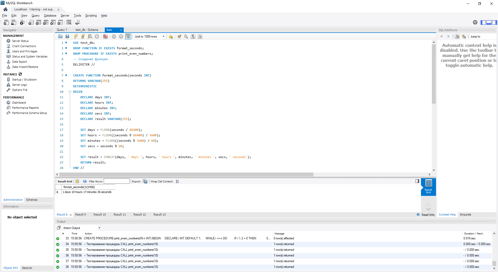
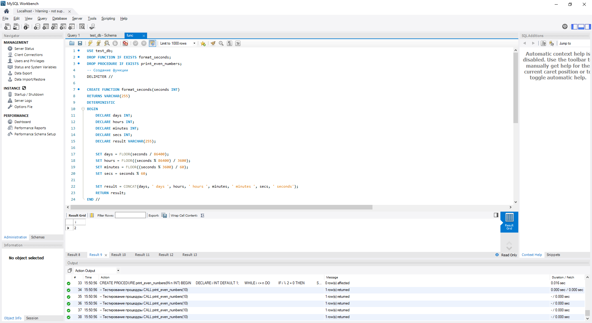
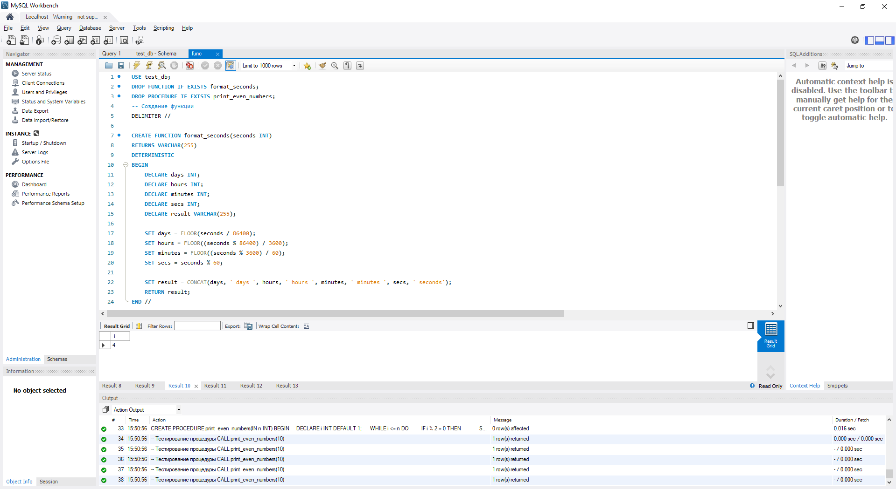
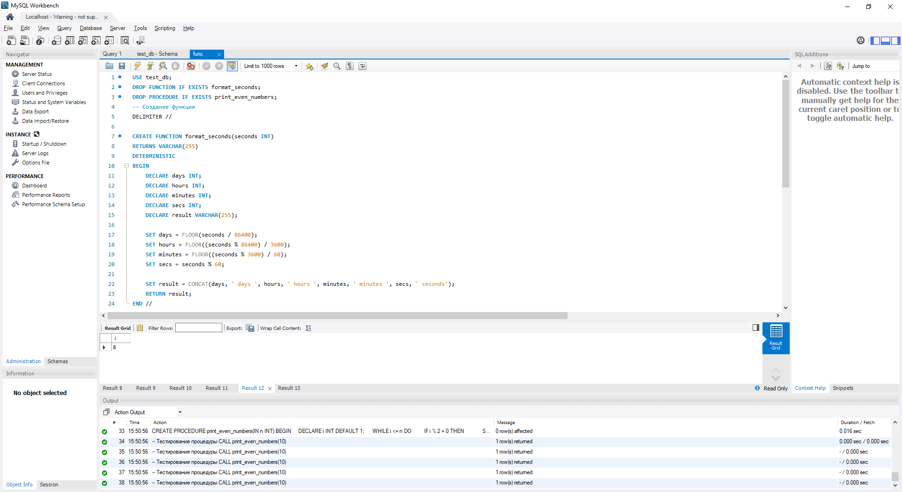

# Код

USE test_db;

DROP FUNCTION IF EXISTS format_seconds;

DROP PROCEDURE IF EXISTS print_even_numbers;

-- Создание функции

DELIMITER //

CREATE FUNCTION format_seconds(seconds INT) 

RETURNS VARCHAR(255)

DETERMINISTIC

BEGIN

    DECLARE days INT;

    DECLARE hours INT;

    DECLARE minutes INT;

    DECLARE secs INT;

    DECLARE result VARCHAR(255);

    SET days = FLOOR(seconds / 86400);

    SET hours = FLOOR((seconds % 86400) / 3600);

    SET minutes = FLOOR((seconds % 3600) / 60);

    SET secs = seconds % 60;

    SET result = CONCAT(days, ' days ', hours, ' hours ', minutes, ' 
    minutes ', secs, ' seconds');

    RETURN result;

END //

DELIMITER ;

-- Тестирование функции

SELECT format_seconds(123456);

-- Создание процедуры

DELIMITER //

CREATE PROCEDURE print_even_numbers(IN n INT)

BEGIN

    DECLARE i INT DEFAULT 1;

    WHILE i <= n DO

        IF i % 2 = 0 THEN

            SELECT i;

        END IF;

        SET i = i + 1;

    END WHILE;

END //

DELIMITER ;

-- Тестирование процедуры

CALL print_even_numbers(10);

# Скрины выполнения

## Функция форматирования

## Процедура подсчёта чётных чисел

# Код (с комментариями)

-- Выбираем базу данных для работы

USE test_db;

-- Удаление существующей функции\процедуры, если она уже существует, чтобы избежать конфликта имен

DROP FUNCTION IF EXISTS format_seconds;

DROP PROCEDURE IF EXISTS print_even_numbers;

-- Устанавливаем разделитель для многострочного выражения

DELIMITER //

-- Создание функции 'format_seconds'

-- Функция принимает количество секунд (INT) и возвращает 
отформатированное время в виде строки (VARCHAR)

CREATE FUNCTION format_seconds(seconds INT) 

RETURNS VARCHAR(255)

DETERMINISTIC

BEGIN

    -- Объявление переменных для дней, часов, минут и секунд

    DECLARE days INT;

    DECLARE hours INT;

    DECLARE minutes INT;

    DECLARE secs INT;

    DECLARE result VARCHAR(255);

    -- Расчет количества дней

    SET days = FLOOR(seconds / 86400);

    -- Расчет количества часов

    SET hours = FLOOR((seconds % 86400) / 3600);

    -- Расчет количества минут

    SET minutes = FLOOR((seconds % 3600) / 60);

    -- Расчет оставшихся секунд

    SET secs = seconds % 60;

    
    -- Формирование результирующей строки
    
    SET result = CONCAT(days, ' days ', hours, ' hours ', minutes, ' minutes ', secs, ' seconds');
    

    
    -- Возвращение результирующей строки
    
    RETURN result;

END //

-- Восстанавливаем стандартный разделитель

DELIMITER ;

-- Тестирование функции 'format_seconds' с примерным входным значением

SELECT format_seconds(123456);

-- Удаление существующей процедуры, если она уже существует, чтобы избежать конфликта имен

DROP PROCEDURE IF EXISTS print_even_numbers;

-- Устанавливаем разделитель для многострочного выражения

DELIMITER //

-- Создание процедуры 'print_even_numbers'

-- Процедура принимает параметр n (INT) и выводит все четные числа от 1 до n в одной таблице

CREATE PROCEDURE print_even_numbers(IN n INT)

BEGIN

    -- Удаление временной таблицы, если она существует, чтобы избежать ошибок

    DROP TEMPORARY TABLE IF EXISTS temp_even_numbers;
    
    -- Создание временной таблицы для хранения четных чисел

    CREATE TEMPORARY TABLE temp_even_numbers (number INT);

    -- Объявление переменной цикла

    DECLARE i INT DEFAULT 1;

    -- Цикл для перебора чисел от 1 до n

    WHILE i <= n DO

        -- Проверка, является ли число четным

        IF i % 2 = 0 THEN

            -- Вставка четного числа во временную таблицу

            INSERT INTO temp_even_numbers (number) VALUES (i);

        END IF;

        -- Увеличение счетчика

        SET i = i + 1;

    END WHILE;

    -- Выбор всех четных чисел из временной таблицы и вывод их в одной 
    таблице
    
    SELECT number FROM temp_even_numbers;
END 
//

-- Восстанавливаем стандартный разделитель

DELIMITER ;

-- Тестирование процедуры 'print_even_numbers' с примерным входным 
значением

CALL print_even_numbers(10);
